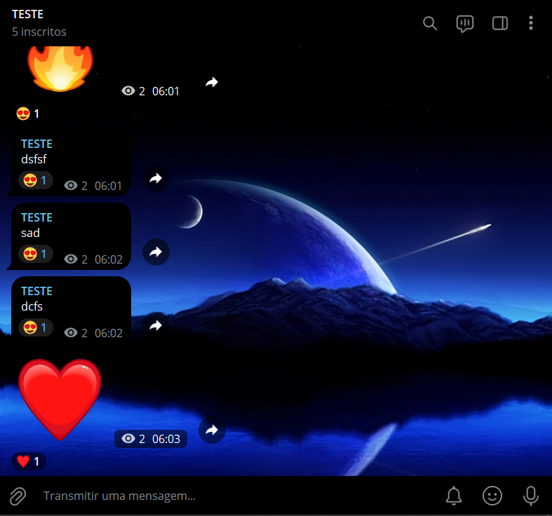

# BOT DE REACOES EM CANAIS
🛑ESSE É UM BOT DO TELEGRAM QUE REAJE AS POSTAGENS DO CANAL!

 <br>

## DESCRIÇÃO:
Este bot foi projetado para reagir a mensagens de texto postadas em um canal do Telegram com uma reação aleatória. 

1. Quando uma mensagem de texto é postada no canal especificado, o bot seleciona aleatoriamente uma reação da lista de emojis definida na variável.

2. Em seguida, o bot utiliza a função para aplicar essa reação à mensagem recém-publicada no canal.

## PROCEDIMENTO DE COMPRA:
- Para efetuar a compra, por favor, entre em contato comigo por mensagem privada, informando:
    ```bash
    Gostaria de adquirir o bot: https://github.com/VILHALVA/BOT-DE-REACOES-EM-CANAIS
    ```
- Após a confirmação do pagamento e o envio do comprovante, você receberá um arquivo zip contendo o código-fonte do bot, acompanhado de um manual detalhado (`MANUAL.md`), que oferece instruções abrangentes sobre a configuração do ambiente, sugestões de cursos e documentação recomendada, bem como o arquivo `HOSPEDAGEM.md`, contendo orientações para hospedar o seu bot.

- [🤑CLIQUE AQUI PARA ENTRAR EM CONTATO](https://t.me/VILHALVA100)
- [🧑‍💻PRECISA DE UM FREELANCER? CLIQUE AQUI PARA VER EM TELEGRAPH](https://telegra.ph/FREELANCER-10-19-9)
- [🧑‍💻PRECISA DE UM FREELANCER? CLIQUE AQUI PARA VER EM README](https://github.com/VILHALVA/VILHALVA/blob/main/FREELANCER/README.md)
